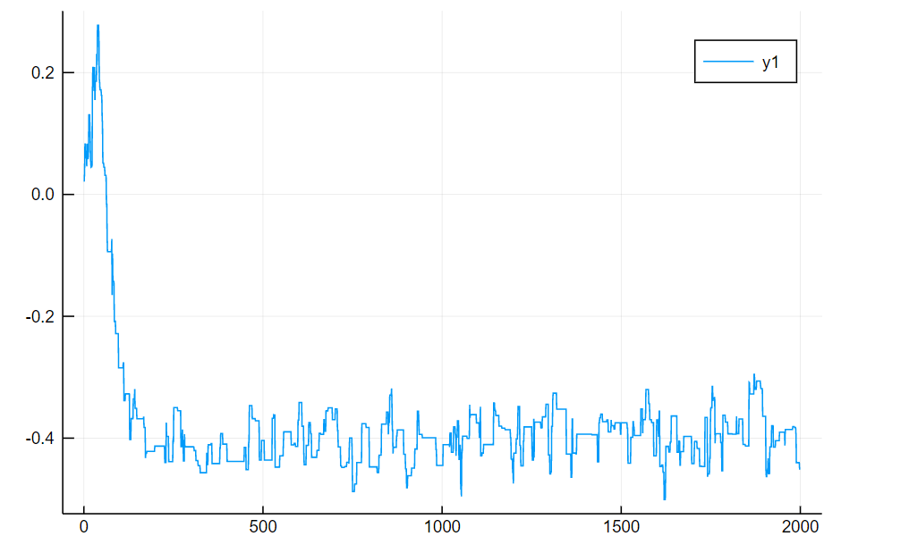

# 用 Julia 写个PPL

我对 Julia 感兴趣是因为 MCMC 这样的方法的并不能自然的被矢量化，所以可以看到 PPL（Probability programming language，概率编程语言）变成了Julia的一大[社区](https://discourse.julialang.org/c/domain/probprog)，因为概率编程语言背后的一般贝叶斯模型，使用MCMC求解起码是曾经的标准方法，尽管最近变分推断之流使得MCMC的重要性下降了。

Julia的DSL其实还是在Julia内部的语法框架内，所以你不能写一些诸如`f a b`之类的语句，而至多能写成`@f a b`这样，因为Julia的宏本来就允许类函数的括号“调用”和这种空格“调用”，而普通函数调用则不行。不过Turing.jl能把概率模型写的这么简洁还是令人吃惊：

```julia
@model GaussianMixtureModel(x) = begin
    D, N = size(x)
    
    μ1 ~ Normal()
    μ2 ~ Normal()
    
    μ = [μ1, μ2]
    
    w = [0.5, 0.5]
    
    k = Vector{Int}(undef, N)
    for i in 1:N
        k[i] ~ Categorical(w)
        x[:,i] ~ MvNormal([μ[k[i]], μ[k[i]]], 1.)
    end
    return k
end

```

原文参见Julia 的[Tutoria](https://turing.ml/dev/tutorials/1-gaussianmixturemodel/)，槽点在于这个例子现在其实是无法运行的，参见这个[issue](https://github.com/TuringLang/Turing.jl/issues/914)了解如何运行。

这样程度的简洁往往需要新定义的语言才能实现，如stan，webppl等，如这个 ~ 在Python中就无法自然的实现，因为 ~ 的运算符重载是单元运算符。而首先Julia的运算符重载就很强大：

```julia
function ~(a::String, b::String)
    return a * " follows " * b
end

"X" ~ "Normal(0,1)" # out: "X follows Normal(0,1)"
```

当然只是能重载~的二元版本并没有什么用。因为如果真写出`X ~ Normal(0,1)`之类的代码的话，`X`会被先求值，虽然我们可以给它赋予一个新类型重载到特定的~处理中，其包含字符值`"X"`。每次`~`看到时就会与“当前状态”中`X`的联系起来等，不过这对应一种十分复杂的处理。用宏则简单干脆一些。

## AST

AST（Abstract syntax tree,抽象语法树)可以看作对字符串形式的代码提供了一个对象的表示。如在Python中

```python
import ast
tree = ast.parse("print('hello ast')")
expr = tree.body[0]
type(expr) # _ast.Expr
type(expr.value) # _ast.Call
expr.value.func.id # 'print'
expr.value.args[0].s # 'hello ast'
```

可以看懂纯字符串形式的原代码中解析出一个对象构成的树，各个节点上放着元信息和值。使用ast可以容易分析代码或者把它映射到其他语言上去。不过ast模块看上去不支持把ast对象转回代码或者直接执行ast之类的特性，也许是为抑制这种使用类似宏操作而刻意为之。

不过Julia可以这么做，如

```julia
ex = :(println("hello ast"))
typeof(ex) # Expr
ex.head # :call
ex.args[1] # :println
ex.args[2] # "hello ast"

eval(ex) # hello ast
```

可以直接执行ast对象使得操作ast的表达式对象就像在生成代码一样：

```julia
ex # :(println("hello ast"))
push!(ex.args, "hello ppl")
ex # :(println("hello ast", "hello ppl"))
eval(ex) # "hello asthello ppl"
```

表达式对象也可以直接用纯对象生成

```julia
Expr(:call, :println, "hello ast")
```

`:call,:println`,这样的称为Symbol，可以看成加上了其他类型的字符串，`string(:call) == "call"`。实际意思顾名思义。

创建表达式对象和调用`eval`可以用宏简洁的表示。

```julia
@hello_ppl_too println("hello ast") # hello asthello_ppl
```

宏的写法：

```julia
macro hello_ppl_too(expr)
    args = expr.args
    push!(args, "hello ppl")
    return Expr(expr.head, args...)
end
```

可以看到无非就是宏的参数位置上的表达式现在不会被求解（相当于自带一个`:()`）而是被直接传进宏的参数中，然后一个宏返回的表达式对象又会被直接eval。这些操作不用`macro`的语法也完全可以做，只是省这几个符号对于DSL的简洁性很有帮助，Julia总是在不断的引入更多意义不明的糖来使得一些微不足道的地方看起来漂亮一些。

Julia的ast参见[文档](https://docs.julialang.org/en/v1/devdocs/ast/).虽然没有它自称的S表达式那么简单，不过还是比Python那一堆类简单得多。

## ~ 是什么

了解了宏的能力，可以设想把`X ~ Normal(0,1)`里的符号进行排列组合，变成期望的形式即可。如Stan的处理，把这些采样语句单纯当成对模型的对数概率的累积过程的描述:
$$
\log P(L,D) = \log P(D|L) + \sum_{i=1}^n \log P(L_i | L_{1:i-1})
$$
也就是转成类似这样`logp += logpdf(Normal(0.1), X)`。输入看起来像这样：

```julia
ex = :(X ~ Normal(0,1))
typeof(ex) # Expr
ex.head # :call
ex.args[1] # :~
ex.args[2] # :X
ex.args[3] # :(Normal(0,1))
```

这很容易做到

```julia
function sampling_convert(expr::Expr)
    @assert (expr.head == :call) && (expr.args[1] == :~)
    rv, dist = expr.args[2:3]
    return :(logp += logpdf($dist, $rv))
end

sampling_convert(:(X ~ Normal(0,1))) # :(logp += logpdf(Normal(0, 1), X))
```

这里利用`$`插值，可以回避写一些大量ast对象操作产生“模板”的繁琐代码。不使用`$`插值的话，可能要写成

```julia
function sampling_convert(expr::Expr)
    @assert (expr.head == :call) && (expr.args[1] == :~)
    rv, dist = expr.args[2:3]
    return Expr(:+=, :logp, Expr(:call, :logpdf, dist, rv))
end

sampling_convert(:(X ~ Normal(0,1))) # :(logp += logpdf(Normal(0, 1), X))
```

这个“S-表达式风格的代码在代码本身不是用S表达式写的情况下看起来可读性不怎么样。

这么写假定宏展开的作用域上确实有`X`这个变量，但是不是去试图访问`X`而是以`:X`为Key去访问某个Dict上的对应值是有用的。即想要类似这样的形式`logp += logpdf(Normal(0,1), binding[:X])`。这个直接插值,如：`return :(logp += logpdf($dist, binding[$rv]))`不行，结果是`:(logp += logpdf(Normal(0, 1), binding[X]))`。可以用`QupteNode`包一层：

```julia
function sampling_convert(expr::Expr)
    @assert (expr.head == :call) && (expr.args[1] == :~)
    rv, dist = expr.args[2:3]
    nest_rv = QuoteNode(rv)
    return :(logp += logpdf($dist, binding[$nest_rv]))
end

sampling_convert(:(X ~ Normal(0,1))) #:(logp += logpdf(Normal(0, 1), binding[:X]))
```

现在尝试把一个经典的投硬币模型(Beta-Bernoulli模型)中的`~`全部转换掉：

```julia
quote
    p ~ Beta(alpha, beta)
    for i in eachindex(x)
        x[i] ~ Bernoulli(p)
    end
end
```

首先是`replace_symbol_into_dict`函数，它把`symbol_set`里的符号像上面提到的一样换到一个Dict里：

```julia
function replace_symbol_into_dict(symbol_set::Set, dict_symbol::Symbol, expr)
    if typeof(expr) == Symbol
        if in(expr, symbol_set)
            nest_expr = QuoteNode(expr)
            return [:($dict_symbol[$nest_expr])]
        end
        return [expr]
    end
    
    if typeof(expr) != Expr
        return [expr]
    end
    
    new_expr = Expr(expr.head)
    for arg in expr.args
        append!(new_expr.args, replace_symbol_into_dict(symbol_set, dict_symbol, arg))
    end
    return [new_expr]
end

replace_symbol_into_dict(Set([:p]), :binding, quote
    p ~ Beta(alpha, beta)
    for i in eachindex(x)
        x[i] ~ Bernoulli(p)
    end
end)[1]

#=
quote
    #= In[45]:2 =#
    binding[:p] ~ Beta(alpha, beta)
    #= In[45]:3 =#
    for i = eachindex(x)
        #= In[45]:4 =#
        x[i] ~ Bernoulli(binding[:p])
    end
end
=#
```

这里有繁琐的递归，如何避免这些样板废话参见Turing.jl使用的[MacroTools.jl](https://mikeinnes.github.io/MacroTools.jl/stable/pattern-matching/).这里不用它。

搜索所有的`~`并执行替换由`sub4`实现：

```julia
function sub4(symbol_set::Set, expr)
    if typeof(expr) != Expr
        return [expr]
    end
    if (expr.head == :call) && (expr.args[1] == :~)
        sym = expr.args[2]
        dist = expr.args[3]
        
        logp_expr = :(logp += logpdf($dist, $sym))
        logp_proposed_expr = :(logp_proposed += logpdf($dist, $sym))
        return [
            replace_symbol_into_dict(symbol_set, :symbol_map, logp_expr)[1],
            replace_symbol_into_dict(symbol_set, :proposed_map, logp_proposed_expr)[1]
        ]
    end
    new_expr = Expr(expr.head)
    for arg in expr.args
        append!(new_expr.args, sub4(symbol_set, arg))
    end
    return [new_expr]
end

sub4(Set([:p]), quote
    p ~ Beta(alpha, beta)
    for i in eachindex(x)
        x[i] ~ Bernoulli(p)
    end
end)[1]

#=
quote
    #= In[47]:2 =#
    logp += logpdf(Beta(alpha, beta), symbol_map[:p])
    logp_proposed += logpdf(Beta(alpha, beta), proposed_map[:p])
    #= In[47]:3 =#
    for i = eachindex(x)
        #= In[47]:4 =#
        logp += logpdf(Bernoulli(symbol_map[:p]), x[i])
        logp_proposed += logpdf(Bernoulli(proposed_map[:p]), x[i])
    end
end
=#
```

## 你已经学会了1+1=2，接下来让我们...

总之差不多就是这些东西，全部代码：

```julia
function replace_symbol_into_dict(symbol_set::Set, dict_symbol::Symbol, expr)
    if typeof(expr) == Symbol
        if in(expr, symbol_set)
            nest_expr = QuoteNode(expr)
            return [:($dict_symbol[$nest_expr])]
        end
        return [expr]
    end
    
    if typeof(expr) != Expr
        return [expr]
    end
    
    new_expr = Expr(expr.head)
    for arg in expr.args
        append!(new_expr.args, replace_symbol_into_dict(symbol_set, dict_symbol, arg))
    end
    return [new_expr]
end

function sub4(symbol_set::Set, expr)
    if typeof(expr) != Expr
        return [expr]
    end
    if (expr.head == :call) && (expr.args[1] == :~)
        sym = expr.args[2]
        dist = expr.args[3]
        
        logp_expr = :(logp += logpdf($dist, $sym))
        logp_proposed_expr = :(logp_proposed += logpdf($dist, $sym))
        return [
            replace_symbol_into_dict(symbol_set, :symbol_map, logp_expr)[1],
            replace_symbol_into_dict(symbol_set, :proposed_map, logp_proposed_expr)[1]
        ]
    end
    new_expr = Expr(expr.head)
    for arg in expr.args
        append!(new_expr.args, sub4(symbol_set, arg))
    end
    return [new_expr]
end

function expand_data(expr)
    # @data x y z -> x = data[:x]; ... @data x,y,z is not valid in current implementation
    @assert expr.head == :macrocall
    
    data_dict_symbol = Symbol(string(expr.args[1])[2:end]) # Symbol("@data") -> Symbol("data") or :data
    
    arr = Vector()
    symbol_arr = Vector()
    for arg in expr.args[2:end]
        if typeof(arg) == Symbol
            nest_arg = QuoteNode(arg)
            push!(arr, :($arg = $data_dict_symbol[$nest_arg]))
            push!(symbol_arr, arg)
        end
    end
    return arr, symbol_arr
end


# search for @data and @parameter in top level, convert them to statement block and Lreturn them
function parse_data_parameter(expr)
    @assert expr.head == :block
    
    line_vec = Vector()
    data_vec = Vector()
    latent_vec = Vector()
    
    for line in expr.args
        if (typeof(line) == Expr) && (line.head == :macrocall)
            macro_symbol = line.args[1]
            
            if in(macro_symbol, [Symbol("@data"), Symbol("@latent")])
                arr, symbol_arr = expand_data(line)
                
                if macro_symbol == Symbol("@data")
                    append!(data_vec, symbol_arr)
                    #append!(line_vec, arr) # remove two lines, new lines should be created by top function
                elseif macro_symbol == Symbol("@latent") 
                    append!(latent_vec, symbol_arr)
                    #append!(line_vec, arr) 
                end
                
                continue
            end
        end
        push!(line_vec, line)
    end
        
    return Expr(expr.head, line_vec...), data_vec, latent_vec
end

function build_model_part(expr)
    
    expr, data_vec, latent_vec = parse_data_parameter(expr)
    symbol_set = Set(latent_vec)
    
    data_part = Expr(:block)
    for d_symbol in data_vec
        rest_node = QuoteNode(d_symbol)
        push!(data_part.args, :($d_symbol = data[$rest_node]))
    end
    
    propose_part = quote
        # propose and logq_x_given_y

        logq_old_given_proposed = 0.0
        logq_proposed_given_old = 0.0

        for (sym, proposal) in propose_map

            dist_given_old = proposal(symbol_map[sym])
            proposed_map[sym] = rand(dist_given_old)
            dist_given_proposed = proposal(proposed_map[sym])

            logq_old_given_proposed += logpdf(dist_given_proposed, symbol_map[sym])
            logq_proposed_given_old += logpdf(dist_given_old, proposed_map[sym])
        end
    end
    
    model_part = sub4(symbol_set, expr)[1]
    
    accept_part = quote
        # accept
        log_accept = logp_proposed - logp + logq_old_given_proposed - logq_proposed_given_old
        accept = exp(log_accept)

        accepted = rand() < accept
        if accepted
            symbol_map = proposed_map
        end

        for (sym, value) in symbol_map
            trace_map[sym][n] = symbol_map[sym]
        end
        trace_map[:_accept][n] = accept
        trace_map[:_accepted][n] = accepted
    end
    
    return quote function(data, symbol_map, propose_map)
            
            $data_part
            
            trace_map = Dict{Symbol, Any}()
            for (sym, value) in symbol_map
                trace_map[sym] = Array{typeof(value)}(undef, N)
            end
            trace_map[:_accept] = Array{Float64}(undef, N)
            trace_map[:_accepted] = Array{Float64}(undef, N)

            for n in 1:N
                proposed_map = Dict{Symbol, Real}()

                $propose_part

                # logp and logp_proposed
                logp = 0.0
                logp_proposed = 0.0

                $model_part
                $accept_part

            end

            return trace_map
        end
    end
end

macro model(expr)
    return build_model_part(expr)
end
```

看看效果，首先是投币例子：

```julia
using Distributions
using Plots

f = @model begin
    
    @data x N alpha beta
    @latent p
    
    p ~ Beta(alpha, beta)
    for i in eachindex(x)
        x[i] ~ Bernoulli(p)
    end
end

x = ones(20)
append!(x, zeros(10))

walk_std = 0.1
data = Dict(:N => 1000, :x => x, :alpha => 1, :beta => 1)
symbol_map = Dict(:p => 0.5)
propose_map = Dict(:p => (p) -> TruncatedNormal(p, walk_std, 0, 1))

trace_map = f(data, symbol_map, propose_map)

plot(trace_map[:p])
```


```julia
mean(trace_map[:p]), std(trace_map[:p])
# (0.6441539350616866, 0.08736421033447403)
```

精确解

```julia
exact = Beta(1+20,1+10)
mean(exact), std(exact)
# (0.65625, 0.08267972847076846)
```

无内鬼，来点贝叶斯回归

```julia
f2 = @model begin
    
    @data N x y
    @latent alpha beta
    
    alpha ~ Normal(0, 10)
    beta ~ Normal(0, 10)
    for i in eachindex(x)
        y[i] ~ Normal(alpha + beta * x[i], 0.1)
    end
end

walk_std = 0.05

x = range(0,1,length=100)
y = 1.5 .-0.5 .* x .+ 0.1 .* randn(100)

data = Dict(:N => 1000, :x => x, :y => y)
symbol_map = Dict(:alpha => 0.0, :beta => 0.0)
propose_map = Dict(:alpha => (p) -> Normal(p, walk_std),
                    :beta => (p) -> Normal(p, walk_std))

trace_map = f2(data, symbol_map, propose_map)

plot(trace_map[:alpha])
plot(trace_map[:beta])
```




```julia
mean(trace_map[:alpha][200:end]), std(trace_map[:alpha][200:end])
#(1.4429917400736434, 0.02038420097401971)
mean(trace_map[:beta][200:end]), std(trace_map[:beta][200:end])
#(-0.40056187112594976, 0.03505674676079989)
```


