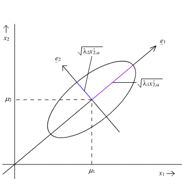

# HMC的分析

## 背景回顾

当满足一定正则条件时，转移概率$p(s_i \to s_j)$存在唯一的稳态分布$P(s_i)$。对任意分布$P(x)$的直接采样难以进行，通过设计转移概率$p(s_i\to s_j)$来实现对$P(x)$的采样就是MCMC方法。因为满足条件时的平稳分布是唯一的，我们只需要证明一个分布$P(x)$是$p(s_i \to s_j)$的平稳分布，即满足：
$$
\sum_{i} p(s_i \to s_j)p(s_i) = p(s_j) \quad \forall j
$$
即可，显然，若满足以下 detailed balance 条件：
$$
p(s_i \to s_j)p(s_i) = p(s_j \to s_i)p(s_j)
$$
则
$$
\sum_i p(s_i \to s_j)p(s_i) = \sum_i p(s_j \to s_i)p(s_j) = p(s_j)\sum_i p(s_j \to s_i) = p(s_j)
$$
即 detailed balance 是使得转移概率$p(x_i \to x_j)$的平稳分布是$P(x)$的充分条件。

转移概率的常采用分两步构造的方式，先设定一个相对随意的Proposal分布$P^*(x_i \to x_j)$，再根据Proposal和P(x)定出接收概率$A(x_i \to x_j)$，以此定出满足 detailed balance 的转移概率：
$$
p(s_i \to s_j) = P^*(s_i \to s_j)A(x_i \to x_j)
$$
尝试代入
$$
\sum_i p(s_i \to s_j)p(s_i) = \sum_i p^*(s_i \to s_j)A(x_i \to x_j)p(s_i)
$$
显然把$A(x_i \to x_j)$设成正好消掉已有项，加上目标项即可凑成目标形式，即:
$$
A(x_i \to x_j) = \frac{p^*(s_j \to s_i)p(s_j)}{p^*(s_i \to s_j)p(s_i)}
$$
一种常见的 Metropolis-Hasting 采样的设法是选择$P^*(s_i \to s_j)$为以之前的采样结果$s_i$为中心的，标准差是事先给定的超参数$\sigma$的一个正态分布：
$$
P^*(s_i \to s_j) = N(s_j | s_i, \sigma^2)=N((s_j-s_i)/\sigma|0,1)
$$
## 辅助变量

直接在$X$内部采样可能不太容易，可以以某种方式引入辅助变量$Y$，构成联合分布$P(X,Y)$。显然$P(X,Y)$的样本中直接扔掉$Y$得到的就是目标/边际分布$P(X)=\int_Y P(X,Y)$的样本。这样问题就转成了如何构造$Y$。

首先考虑一般的$X,Y$的关系，此时可以考虑在$P(X|Y)$与$P(Y|X)$交替采样。只考虑$P(X|Y)$的话:
$$
A(X,Y \to X',Y) = 
\frac{p^*(X',Y \to X,Y)p(X',Y)}{p^*(X,Y \to X',Y)p(X,Y)}=
\frac{P(X|Y)P(X',Y)}{P(X'|Y)P(X,Y)} =
\frac{P(X,Y)/P(Y)P(X',Y)}{P(X',Y)/P(Y)P(X,Y)}=
1
$$
显然$P(Y|X)$的情况完全类似，则这种转移本身和Gibbs采样一样，都是概率1接受转移的。

这种操作看上去用处不大，如假设$Y$和$X$独立的话，$P(X|Y)$就相当于从$P(X)$中采样，这就倒退回了原问题。而如何设定使得$P(X|Y)$比$P(X)$还简单并不是显然的（[slice samping](<https://en.wikipedia.org/wiki/Slice_sampling>)）。

如果设定$X,Y$独立，且给$Y$一个简单的分布，如对角协方差矩阵的多元正态分布，且只执行$P(Y|X)=P(Y)$从上面的论证看上去也是接受率为1的转移，然而它实际上只在改变$Y$，显然不是正确的$P(X,Y)$的样本，问题出在MCMC的正则条件之一，存在唯一平稳分布不符合，而这又是因为遍历性/不可约性不符合，即有的状态无论过多久，转移到另外某个(组)状态的概率依然是0。这里它们被不同的$X$分开了——它们可以“被归约（划分）为”以$X$分类的，完全分离的若干马尔可夫链。

然而我们又想，虽然只变化$Y$是不可行的，但我们是否能根据$Y$的新值定义一个变换$T(X,Y)\to X',Y'$，使得上述不可约性又满足了呢？考虑到$Y$的多元正态分布非零密度可以覆盖整个$R^d$（d是$X,Y$的维数），我们只需要让$T(X,Y)$在固定$X$下可能映射到所有$R^d$里可能的$X'$取值（$Y'$的遍历可以由第二步再做）即可，这看上去并不困难，只要引入一个类似$X'=0.0000000001Y$之类的项即可，其可在即使不符合条件$T$上做任意小的变化使其满足条件。

当然这种讨论会引发疑问：按此逻辑，$T(X,Y)=(X,Y)$，即只随机采样$Y$+并不做任何改变，不也可以通过加上“任意小的变化”变为遍历的吗。这其实没错，只是效率非常差而已。下面我们指出一种效率足够高的引入$T$的方法。

## HMC

设所期望采样的分布$P(X)$的负对数似然函数为$U(x) = -\log P(X)$。

追加一组与$X$维度相同的辅助变量$Y$，与$X$成独立关系，边际分布为$Q(Y)$，负对数似然为$K(X)=-\log Q(Y)$。则联合概率可表为
$$
P(X,Y)=\frac{1}{Z}e^{-(U(X)+K(Y))}=\frac{1}{Z}e^{-H(X,Y)}
$$
其中$H(X,Y)$称为Hamiltonian。我们试图出定义一种确定性变换$T(X,Y)=(X',Y')$，使得$H(X,Y)=H(X',Y')$。如此，如果我们在$H(X,Y)$上定义的分布上作用$T$，则接受率总是$1$。这可以通过在$H(X,Y)=C$等高线上运动一段距离来实现。对$H(X,Y)=C$两边对$t$求导可得：
$$
\frac{dH}{dt}=\frac{d}{dt}(U(X)+K(Y))=\frac{dX^T}{dt}\nabla_X U(X)+\frac{dY^T}{dt}\nabla_Y K(Y)
$$
类似之前$A(s_i \to s_j)$的构造，我们想让$\frac{dH}{dt}=0$，只需要设定：
$$
\begin{aligned}
\frac{d X}{dt}&= \nabla_Y K(Y)\\
\frac{d Y}{dt}&= -\nabla_X U(X)
\end{aligned}
$$
上面两个式子定义了一个哈密顿动力学系统，即在$H$不变的更高线上运动，如此可以保持接受率为1且可以遍历，类似拉格朗日乘子法。运动的长度可以固定也可以随机指定。

当$Q(Y)$取成零均值多元正态$N(\mu_Y,\Sigma_Y)$时，即
$$
Q(Y) = (2\pi)^{k/2}\det(\Sigma)^{-1/2}e^{-1/2(Y-\mu_Y)^T\Sigma_Y^{-1}(Y-\mu_Y)}=
\frac{1}{Z_Q}e^{K(Y)}
$$
其中$K(Y)=(Y-\mu_Y)^T\Sigma_Y^{-1}(Y-\mu_Y)Y/2$,而若又设$\Sigma_Y=I,\mu_Y=\mathbf{0}$，则

$$
\frac{dX}{dt}=\nabla_Y K(Y)=\Sigma_Y^{-1}(Y-\mu_Y)=Y
$$
即$X$的速度等于$Y$，这就是为什么辅助变量$Y$有时被称为动量(momentum)项。当然$Y$其实完全可以取成非对称或非正态的形式，此时把$Y$称为动量项也没什么特别的道理。

另一方面看，无论$K(Y)$本身怎么设定的：
$$
\frac{dY}{dt}=-\nabla_X U(X)=- \nabla_X - \log P(X)=\nabla_X \log P(X)
$$
可以看到辅助变量$Y$总是向着局部看到的最大似然方向移动。所以当$Y$成多元正态，即的确可以解释成动量时，系统有着向MAP移动的趋势。

## 动力系统模拟

假如真的可以从动力系统中解出移动$t$时刻后对应的变换$T(X,Y)=(X',Y')$可以得到理想的1接受率，然而往往只能求模拟解。

最直观的模拟法如欧拉法$x(t+\Delta t) = x(t)+\frac{dx}{dt}\Delta t$。它很多地方性质不怎么好，如它内部也不是可逆的即

$x(t) + \frac{dx}{dt}|t \Delta t - \frac{dx}{dt}|_{t+\Delta t} \Delta t= x(t+\Delta t) - \frac{dx}{dt}|_{t+\Delta t} \Delta t \neq x(t)$，

我以前Ludum dare 35做过一个[游戏](https://github.com/yiyuezhuo/Ludum-Dare-35)，在二维场中还原被扰动的粒子形状，因为用的是欧拉法，又需要可逆性，被这个问题折腾一番，只是降低步长是不可行的，最后用缓存以前的状态装作解决了这个问题：

（上图的原形状是一个圆）

考虑以下Leap-Frog算法,设$a_i = F(x_i)$

起始($i=0$)：

$$
\begin{aligned}
v_{1/2} &= v_0+a_0 \Delta t/2 \\
x_{1}   &= x_0 + v_{1/2} \Delta t
\end{aligned}
$$
迭代($i \in \{ 1,\dots,L-1 \}$)：
$$
\begin{aligned}
v_{i+1/2} &= v_{i-1/2}+a_i \Delta t \\
x_{i+1} &= x_i + v_{i+1/2} \Delta t
\end{aligned}
$$
收尾($i=L$):
$$
v_{L} = v_{L-1/2} + a_{L} \Delta t/2
$$
这定义了一个变换$(x_0,v_0) \to (x_{L},v_{L})$,问使用相同的$F(x_i)$，$(x_{L+1},-v_{L+1}) \to ?$。我们试图证明$(x_{L+1},-v_{L+1}) \to (x_0, -v_0)$。使用归纳法证明$v_{L+s}=-v_{L-s}$与$x_{L+s}=x_{L-s}$,$a_{L+s}=a_{L-s}$

初始:
$$
\begin{align*}
v_{L+1/2} &= -v_L + a_L \Delta t/2 &= -(v_L - a_L \Delta t/2) &= -v_{L-1/2} \\
x_{L+1} &= x_L + v_{L+1/2} \Delta t &= x_L - v_{L-1/2} &= x_{L-1}
\end{align*}
$$
这也同时证明了归纳法的初始条件。

迭代：
$$
\begin{aligned}
v_{L+i+1/2} &= v_{L+i-1/2} + a_{L+i} \Delta t = -v_{L-i+1/2} + a_{L-i} \Delta t  = -(v_{L-i+1/2}-a_{L-i} \Delta t) = -v_{L-i-1/2}\\
x_{L+i+1} &= x_{L+i} + v_{L+i+1/2} \Delta t = x_{L+i} -v_{L-i-1/2}=x_{L-i}
\end{aligned}
$$

这就证明了归纳步($t \in \{L+1, \dots, 2L-1 \}$)

收尾:
$$
v_{2L}=v_{2L-1/2}+a_{2L} \Delta t = -v_{1/2}+a_0 \Delta t = -v_0
$$
将Leap-Elder算法抽象，不把$v$看成速度，而是看成其导数依赖于$x$的函数，而$x$也只不过是一个对时间导数依赖$v$(下面写成$y$)的函数。则可以证明(设$u_t=-\nabla_{x(t)} U(x$),$k_t = \nabla_{y(t)} K(y)$：

起始($i=0$):
$$
\begin{align*}
y_{1/2} &= y_{0}+ u_0 \Delta t/2 \\
x_1 &= x_0 + k_{1/2} \Delta t
\end{align*}
$$
迭代：
$$
\begin{align*}
y_{i+1/2} &= y_{i-1/2}+u_{i-1/2} \Delta t \\
x_{i+1} &= x_{i} + k_{i+1/2} \Delta t
\end{align*}
$$
收尾：
$$
y_{L} = y_{L-1/2} + u_{L} \Delta t/2
$$
仿照之前的证明$(x,v)$的方法可得$(x_L,-y_l) \to (x_0,-y_0)$,假定$k(-y)=-k(y)$(蕴含了辅助变量$y$只能取对称分布)：

起始：
$$
\begin{align*}
y_{L+1/2} &= -y_L + u_L \Delta t/2 = -y_{L-1/2} \\
x_{L+1} &= x_L +k_{L+1/2} \Delta t = x_L - k_{L-1/2} \Delta t = x_{L-1}
\end{align*}
$$
迭代
$$
\begin{align*}
y_{L+i+1/2} &= y_{L+i-1/2}+u_{L+i-1/2} \Delta t = -y_{L-i+1/2}+u_{L-i+1/2} \Delta t = -y_{L-i-1/2} \\
x_{L+i+1} &= x_{L+i} + k_{L +i+1/2} \Delta t = x_{L-i}-k_{L-i-1/2} \Delta t = x_{L-i-1}
\end{align*}
$$
收尾
$$
y_{2L} = y_{2L-1/2} + u_{2L} \Delta t/2 = -y_{1/2} + u_0\Delta t/2=-y_0
$$
这就证明了使用leap-frog迭代$(x,y)$的可逆性。

以此，上面证明了$T(x_0,y_0)=(x_T,y_T) \Rightarrow T(x_T,-y_T)=(x_0,-y_0)$,$T$是系统定义的过程的L步，步长$\Delta t$的leap-elder迭代的定义的映射。

## 两种HMC

定义$(x_{-1},y_{-1})$处的propose如此进行

1. 按$y \sim \frac{1}{z}\exp(-K(y))$采样$y_0$作为迭代初始点，另直接设$x_0=x_{-1}$

2. 用上面描述的变换$T(x_0,y_0)=(x_T,y_T)$

3. 以$(x_T,-y_T)$作为 propose 的状态。

以此，转移概率$P(x_{-1},y_{-1} \to x_T,-y_T)=P(y_0)$。又$P(x_T,-y_T \to x_{-1},y_{-1})=P(X_T,-y_T \to x_{-1},-y_{-1})=P(-y_T)$

则如果用它直接构造MH采样：
$$
A(x_{-1},y_{-1} \to x_T,y_T)=\frac{P(-y_T)P(x_T,y_T)}{P(y_0)P(x_{-1},y_{-1})}
$$
这个其实不是[1]说的那种HMC(下面把这种变体叫y-HMC)。原HMC的整体上不看做$(x,y)$上的采样，而依然看成只有$x$的采样。一个propose就是临时引入$y$，像上面一样操作一番后又抛弃掉，剩下$x_T$，则
$$
P(x_{-1} \to x_T)=P(x_{-1},y_{-1} \to x_{T},y_{T}) = P(y_0)
$$
类似可得：
$$
A(x_{-1} \to x_T) = \frac{P(-y_T)P(x_T)}{P(y_0)P(x_{-1})}=\exp(-(K(-y_T)+U(x_T)-K(y_0)-U(x_{-1})))
$$
理想情况下$A(x_{-1}\to x_T)=\exp(H(x_T,y_T)-H(x_{-1},y_0))$中的$H(x_T,y_T)=H(T(x_{-1},y_{0}))=H(x_{-1},y_0)$，从而使接受率总为1.然而这并不能做到，HMC只是能在步长一样时候取得相对较大的接受率而已（0步长的转移显然也总能接受，但却不是遍历的。任意小的步长以任意高的概率接受且遍历，但却是效率任意低的。）

y-HMC和原HMC有什么区别呢？y-HMC既然把$y$本身考虑进来，肯定会青睐于更高概率的$y$的取值，这种考虑显然为我们的真正目标——$x$的采样引入了一些无谓的，因为propose到$y$的低似然区域而拒绝转移的可能，降低了采样的效率（因为$P(X,Y)=P(X)P(Y)$，比较可得y-HMC上$y$的权重比HMC更高）。虽然y-HMC在获取$(x,y)$轨迹后弃掉$y$的分布与HMC应该是一样的。

## 采样难度

何谓充分采样一个分布？对于不止能取一个值的分布，采样一个肯定是不够的，那多少个算够？我们粗略的直觉可能是它会与熵或标准差之类的相关。如果不是独立采样而是MCMC这种，我们可能会隔几个采样才取一个样本作为有效样本，那这种有效样本的效果又该如何度量？

单元分布下，步长（或Metropolis-Hasting的propose标准差）总应小于等于标准差（的某个倍数），因为过大步长造成的发散行为通常是复杂而难以理解的。

在保证不发散或震荡情况下，步长越大越好。从而单元下步长应与标准差成正比。

多元分布下则复杂些，假如变量都是独立的，则为了满足总小于标准差原则，（唯一的）步长会受制于最小标准差的变量。有人可能会想对各种变量使用不同的步长，这一般是不可行的，因为实际使用时步长是试出来的，同时调多个步长参数难以做到，所以理论分析时假定可以对不同的变量调到它们各自的最优步长没什么意义，而假定那个共享的唯一的步长调到了最优值（即正比于最小标准差的那个值）则好一些，因为我们可能真的能调到那个值附近。

多元非独立时更复杂些，对非独立多元随机向量$X,E(X)=\mu,Cov(X)=\Sigma$，它的协方差矩阵$\Sigma$不是对角阵，但可以在一二阶矩上被白化,$H(X-\mu)=Y, E(Y)= \mathbf{0},Cov(V)=\Lambda$，$H$是一正交矩阵，$\Lambda$是$Y$的协方差矩阵，$X$的特征值放在对角线上形成的矩阵。假如我们改成先从$Y$上采样，再$X = \mu + H^{-1}Y$得到$X$的样本，则问题在于$Y$上怎么采样，如果仿照独立情况的话，应该受制于$Y$的最小标准差，即$X$的“最大约束方向”的标准差，或者说X的最小特征值的平方根。

(向右上的方向是最少约束方向，对应协方差矩阵最大特征值，从左上到右下的方向是最大约束方向，对应协方差矩阵最小特征值。)

在不发散的前提下，取最大的可能步长是为了尽可能快的覆盖分布的范围。

## Random walk Metropolis-Hasting vs HMC

设一种特殊的随机游走$P(x_i \to x_j)=N(x_j|x_i,\epsilon^2)$。使用此分布propose并且每抽$L$个样本才取一个样本作为trace的一部分。

定义$\epsilon$为HMC的步长或上面的标准差。且设$L$为HMC的leap-frog步数，和MH的弃掉的中间样本（以压制自相关）数量。

用一种统一的符号表示以上两种模式，我们想让以步长$\epsilon$移动$L$步后的样本看起来与之前的状态独立，即$p(x_{L}|x_0) \approx p(x_L)$。显然$var(X_L)\approx var(X_L|X_0)$。我们需要让经单步迭代propose分布迭代后的L步propose分布方差/标准差和独立时的一样。对照RWMH(Random Walk Metropolis-Hasting)和HMC迭代的方差增长模式：

RWMH：
$$
Var(X_L |X_0) = LVar(X_1|X_0) = L\epsilon^2 \propto L\epsilon^2
$$
及多个独立随机变量加起来的方差模式，$Var(\sum_k X)=kVar(X)$。这里假设接受率变化不大，可视为常数（从而可以看作已经包含在$Var(X_1|X_0)$中），否则落在不同区域的接受率模式显然十分复杂无法分析。

HMC:

因为一个L轮迭代的第一步$x$的运动完全由$y$和$\epsilon$决定（之后$y$开始被$x$反过来影响，但第一轮时$y$的值完全是独立抽出来的），所以为了防备这一步被冲到低概率区域开始发散或其他奇异复杂的行为，步长$\epsilon$也应当和前面指出的一样，与最小特征值成正比（因为第一轮的$y$可能正好让$x$指向那个最受约束的方向）。

一个L轮迭代中唯一的一次随机抽取$ y_0 $后，第一次运动的结果为$(x_1,y_1)$。则$(x_k,y_k), k\in 2,\dots,L$在给定$(x_1,y_1)$后并不是随机的。而$L$会设成小到不会发生冲过去又冲回来那种往复的运动（因为leap-toad在$H$相同的等高线（的某个邻域）上至多跑一圈即可，跑多圈只是浪费计算。），从而在理想情况下（初始$y$使得$x$指向较小约束方向运动时），$\frac{dx}{dt}$可以看作常数，即HMC在一轮迭代时**可能**以大的多的概率一直沿某个方向运动。而在类似情况时，RWMH只能做到，如果这样propose的话，接受率会较高，但独立的propose，随机游走行为使得RWMH内在地无法沿着一个方向移动。从而可假设
$$
Var(X_L|X_0) \approx L^2Var^{(1)}(X_1|X_0)=L^2 Var(\epsilon \frac{dx}{dt})= L^2 \epsilon^2Var(\nabla K(Y)) \propto L^2\epsilon^2
$$
设协方差矩阵得最大特征值为$\xi^2$与最小特征值为$\epsilon^2$。则充分采样一个分布的一个必要条件是它以最小特征值决定的$\epsilon$经过L步迭代后能够达到最大特征值对应的方向的方差，则对RWMH：
$$
Var_{MH}(X_L|X_0)=\xi^2 \propto L\epsilon^2 \Rightarrow L \propto \frac{\xi^2}{\epsilon^2}
$$
而对HMC：
$$
Var_{HMC}(X_L|X_0) = \xi^2 \propto L^2\epsilon^2 \Rightarrow L \propto \frac{\xi}{\epsilon}
$$
设最大特征值与最小特征比为$\rho=\frac{\xi^2}{\epsilon^2}$，则$L_{MH} \propto \rho$，$L_{HMC} \propto \sqrt{\rho}$。显然，对于较大的$\rho$，HMC只需要少的多步数就可以达到充分采样一个分布的这个**必要**条件。当然也可以考虑建立其他更充分的必要或者充分条件，不过如果只想要定性结果似乎没有必要。

这个特点称为HMC的回避RWMH的回避随机游走的性质。虽然上面的“步数”的“步”的含义，和计算代价都是不一样的。

## 维数问题

多维情况下，多维互相影响十分复杂，模糊了维度增加本身的效果，所以下面用 replicas 模型捕捉维数本身的信息:假定有以单元函数$U(x)$定义了一个典型分布，则对应的d维replicas模型为$U(\mathbf{x})=\sum_i U(x_i)$，即把一个单元的分布“独立地复制”d份联合到了一起。

回顾正则分布定义$P(x)=\frac{1}{Z}e^{-H(x)}$，其中配分函数$Z=\int e^{-H(x)} dx$使得相对自由指定的能量函数$H(x)$的确可以定义一个分布。构造$Z=\int e^{-H(x)-H(x^*)+H(x^*)}dx=\int e^{-(H(x)-H(x^*))}e^{-H(x^*)}dx^*$。

## Reference

[1] Neal, Radford M. "MCMC using Hamiltonian dynamics." Handbook of markov chain monte carlo 2.11 (2011): 2.

