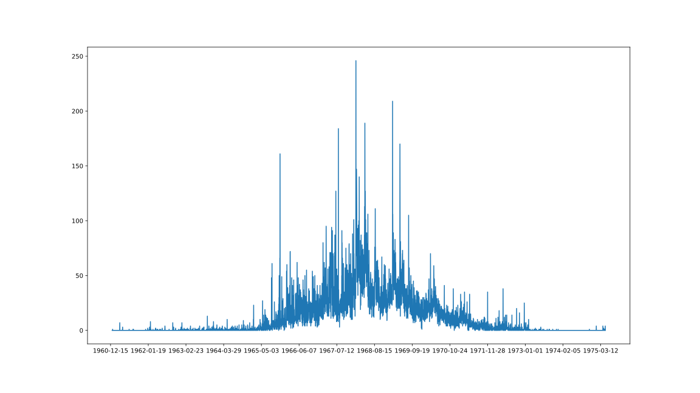
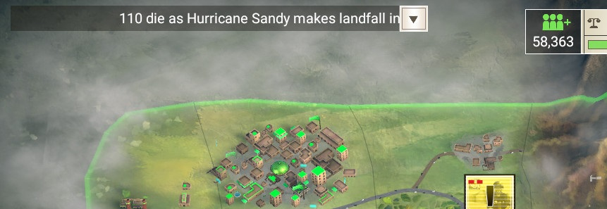
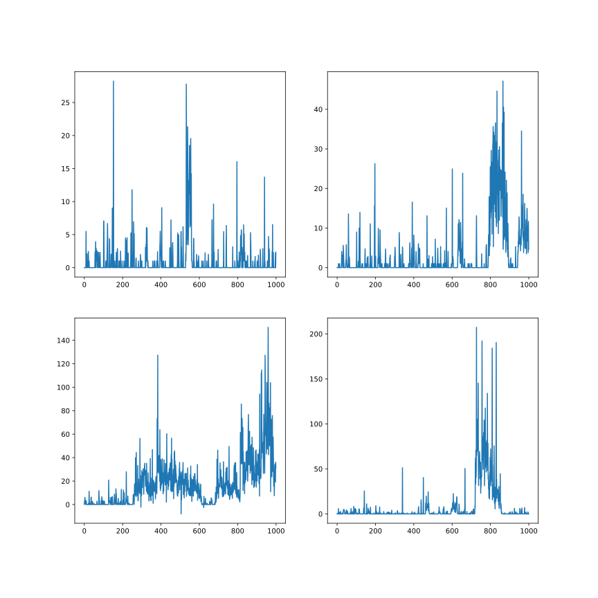
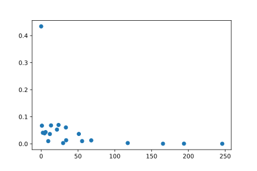
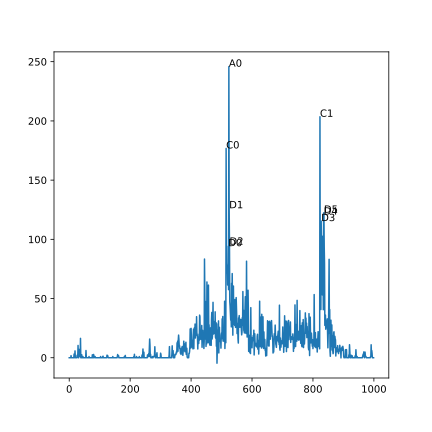

# 越战阵亡数字的模型用作一种游戏机制

## 数据

我看到这篇文章：

https://zhuanlan.zhihu.com/p/81699905

比较了越战和朝战的伤亡（图中是阵亡数字）比较。这个阵亡数据来自美国国防部的阵亡名单数据：

https://catalog.archives.gov/search?q=*:*&rows=20&tabType=all&facet=true&facet.fields=oldScope,level,materialsType,fileFormat,locationIds,dateRangeFacet&highlight=true&f.parentNaId=2163536&f.level=fileUnit&sort=naIdSort%20asc

该页包含朝战和越战的数据，数据在对应页的Electronic Records的`*.dat`文件里，是文本文件，其一行看起来是这样：

```
503503584|Y|S|SELECTED SERVICE|AADLAND GERALD L|A|ARMY|SP4|E04|11B|INFANTRYMAN|19450329|M|SISSETON|ROBERTS|US|SD|SOUTH DAKOTA|NEVER MARRIED|LUTHERAN CHURCHES|LL|WHITE|NOT SPECIFIED|WHITE|UNKNOWN||KONTUM|M2|VS|ASIA|SOUTH VIETNAM|D CO 3 BN 12 INF 4 INF DIV|Z|19680501|19680530|1968|V|C|VIETNAM CONFLICT|SOUTHEAST ASIA|19680530||H|DECEASED|KILLED IN ACTION|SMALL ARMS FIRE||Y|BURIED - UNKNOWN DISP|63W 014|||||
```

上面一行中19680530是阵亡时间，以`|`为分隔符。各列意义参见`View/Download Vietnam Conflict Extract Agency Electronic Documentation`之类的文件。其中还有一些编号，各种原因阵亡之类的信息。

进行适当处理后可以得到类似前述文章的图：



另外我在搜这个数据的时候还找到这个分析阵亡数和美国战争态度关系的文章看起来很有趣：

https://medium.com/@PollsAndVotes/a-statistical-companion-to-the-vietnam-war-7353f1b8abf5

## 游戏中的模型

看到这个数据我想到的是可以用它整一个可以抽类似序列的模型，这应当可以改善一些把越战之类的因素当成“外部变量”的策略游戏/兵棋的性能。换而言之，越战之类的因素对游戏有影响，然而我们却不在模型里直接建模它。比如一个侧重太平洋海战的游戏，它不想建模中国战场的陆战情况，然而中国战场显然对日本对太平洋战场的力量有影响，那么它可能采用这么一个“桌游式”的解决方法：

> 每回合双方投一个骰子，大者往“中日战争进度条”一方自己方向推一格。每格对日方被消耗的资源不同，日方可以投入更多资源增加自己的掷骰点数。

这个方法的好处是它正确建模了中日战争的随机性，这个对影响决策的不确定性的模拟是必要的，完全复刻历史上的消耗和进度会造成其中一方通过这些神谕信息获得优势显然是不恰当的。然而这种重要的不确定性对决策地影响在很多历史向游戏里并没有正确的表现。

上面那种机制也许看起来太粗糙，比起在一条格子上推来推去，一个能对每天产生阵亡数字的模型也许是有用的。比如它可能影响美国一些NGO的行动（而NGO并不能*直接*影响越战的过程），或者影响美国以外的国家的某项议题，或者仅仅作为类似下面这样的背景声音：



[Rebel Inc: Escalation](https://store.steampowered.com/app/1088790/Rebel_Inc_Escalation/) 界面左上角截图。
一个能显示更“真实”死亡数字时序模式的新闻播报条应该很有用（确信）。

一个能产生这种序列的模型，首先要抵抗使用过于还原论，考虑过多细节的诱惑。也就是说考虑的细节应该恰当好处，而不是去把越南的地理情况，每个单位的位置都考虑进去，虽然可以想象一个把这些都模拟了的模型也可以产生这样的序列，甚至更丰富的信息。但更关键的是，在它可以产生的更丰富的信息中，如可以产生随机的，每场战役的位置之类的信息，而实际上我们又只有像那么一个损失数字序列作为可观测数据，这就使得这些战役位置之类的东西变成了隐变量，这增加了从数据中拟合/学习一个模型的难度。

对可观测变量$D$，设定没有必要的隐变量$Z$带来了联合概率$P_\theta(D,Z) = P_\theta(D|Z)P_\theta(Z)$，为了优化它，我们要把隐变量$Z$积掉。

$$
P(D) = \int_Z P_theta(D,Z) dZ
$$

每多一个没必要的隐变量，就多一重积分，使用数值积分法的话，这会带来复杂度的指数上升。

当然其实游戏里很多模型并不是从数据中拟合出来的，而是拍脑袋+手工调出来的。比如HOI4的[陆战机制](https://hoi4.paradoxwikis.com/Land_warfare)，为什么装甲单位对穿甲不足的单位的组织打击是乘6，而不是乘6.1或乘5.9，或普通的4？因为没有从数据中拟合，一切都是凭空设出来的。这使得它的看似详尽的结果和掷两个骰子的中日战争一样幼稚，我还记得被会显示伤亡数字的HOI2:AOD到处都是的0伤亡支配的恐惧。

即使是凭空设，比起这种参数完全由面多了加水，水多了加面的方式进行的人工调优，不如设计一些虚拟数据，让模型去拟合。比如想体现人口的财富与教育的相关性，与其去调整协方差矩阵，不如直接往一个虚拟样本集里加一些财富与教育同高同低的样本，然后估计协方差矩阵。

## HMM

对越战数据一个简单的选择是隐马尔可夫模型HMM，比如我们可以设想有和平状态，几乎没冲突状态，突袭状态，常规战斗烈度1，2，3，4，5几个状态。这些状态每一个对应一个正态分布$N(\mu_i,\sigma^2_i)$。每天从当前状态的正态分布中抽一个数，另外下一天的状态由当前天的状态对应的转移概率决定的离散分布中抽一个。具体参见[wiki百科](https://en.wikipedia.org/wiki/Hidden_Markov_model)。

这个模型有些显然不仅合理的地方，比如虽然存在多个状态与转移，但是状态未跳转时终究是独立的采样，这个不一定合理，如从实际可以看出每场战斗的最高损失都是发生在一开始，如果我们把HMM的状态看成某种烈度的战斗阶段的模板，那前几天的损失和后面的损失同分布看起来就不合理了。当然这可以通过使用更多的状态来试图解决，我们可以试想每个程度的战斗的模板又被细分为两部分，一个是突袭阶段，它基本的下一个转移目标只能是它自己和对应的常规战斗阶段，表示美军从突袭中反应过来。常规阶段则只会转移到它自己或其他突袭或未突袭阶段的状态这样。

使用HMM的主要好处是它比较好拟合/学习。并不存在一般的有效方法可以学习一个概率模型。

下图展示使用20个状态的拟合出的模型的4个样本，长度为1000：



对HMM的估计而言，状态到底表示什么是比较非监督的，我们可以观察那些对应“突袭阶段”，也就是说比较大的均值$\mu_i$，但稳态概率比较低的状态。将对它们的转入看成某种行动的起始，这比直接从生成的样本数据上画更真实些。下图是一次拟合的均值和稳态概率的关系：



有个状态大于100，分别标为ABCD打上标签：



EMMM。。。好像并不怎么样。

HMM给出的结果本身是可以小于0和不是整数的（训练中没有小于0的数据只是看作“正好”没有小于0的数据，而不是通过选择不同于正态的分布来先验地表现这个信息，但是使用正态（近似）会使得学习比较简单。），不过从上面可以看出小于0地情况并不经常发生，这表示直接截断并不会太偏离原来的模型，取整就不用说了。

