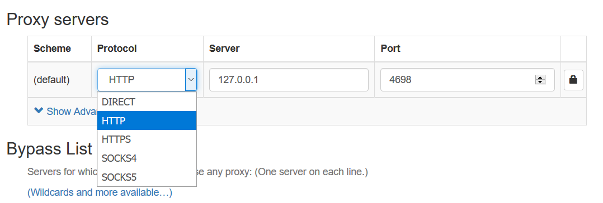
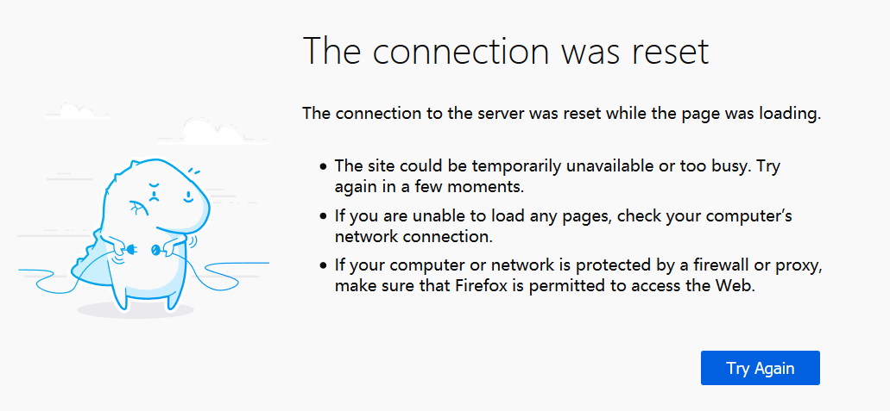

# 写个 Proxy

XX协议被精确识别，YY原是蜜罐节点/APP。为了本质上解决这些问题，了解如何自制Proxy协议事有用的，对如何配v2也有帮助（还是v2好使！）。学习v2这样的次世代使用 golang 编写。Python的模仿 ss 的类似文章已经有人写过了。有兴趣的可以去看。

## Socket

从抽象上看，网上的主机需要建立**连接**才能通信。如看网站时浏览器会让操作系统与所请求的远程主机建立TCP连接，使用ip地址。然后浏览器会向远程主机发送一个byte串，即一个[]byte对象。

```go
package main

import (
	"fmt"
	"log"
	"net"
)

func main() {
	conn, err := net.Dial("tcp", "baike.baidu.com:80")
	if err != nil {
		log.Panic("Fang Binxing died:", err)
	}
	request_str := "GET /item/%E6%96%B9%E6%BB%A8%E5%85%B4/9525950 HTTP/1.1\r\n" +
		"User-Agent: Fang Binxing fucker\r\n" +
		"Host: baike.baidu.com\r\n" +
		"Accept: */*\r\n" +
		"\r\n"
	request_byte := []byte(request_str)
	num_write, err := conn.Write(request_byte)
	if err != nil {
		log.Panic("Fang Binxing NMSL:", err)
	}
	if num_write != len(request_byte) {
		log.Panic("Fang Binxing is conquered by cancer:", num_write, request_byte)
	}

	buff := make([]byte, 2048)
	_, err = conn.Read(buff)
	if err != nil {
		log.Panic("Fang Binxing creep:", err)
	}

	fmt.Println(string(buff))
}

```

可以见识到golang饱受诟病的 `if err != nil` 写法，不过这个写法也有对应的好处。

正常情况下，当前（2019/9/16）百度服务器会向我们做出如下回复：

```html
HTTP/1.1 301 Moved Permanently
Connection: keep-alive
Content-Length: 178
Content-Type: text/html
Date: Mon, 16 Sep 2019 11:51:03 GMT
Location: https://baike.baidu.com/item/%E6%96%B9%E6%BB%A8%E5%85%B4/9525950
P3p: CP=" OTI DSP COR IVA OUR IND COM "
Server: Apache
Set-Cookie: BAIDUID=819BD89C1EC12727E58CFE9B5F2BE0BA:FG=1; expires=Tue, 15-Sep-20 11:51:03 GMT; max-age=31536000; path=/; domain=.baidu.com; version=1

<html>
<head><title>301 Moved Permanently</title></head>
<body bgcolor="white">
<center><h1>301 Moved Permanently</h1></center>
<hr><center>nginx</center>
</body>
</html>
```

我们其实向百度百科主机的80端口发送 get 方某人的页面的 http 请求，百度没有直接返回页面，而返回一个301跳转到 https 版本，高层的http请求库，或浏览器可以自动处理这种情况继续试图请求到最后的页面。不过这里只是为了演示。

我们请求的报文实际是

```
GET /item/%E6%96%B9%E6%BB%A8%E5%85%B4/9525950 HTTP/1.1\r\n
User-Agent: Fang Binxing fucker\r\n
Host: baike.baidu.com\r\n
Accept: */*\r\n
\r\n
```

这里换行只是为了视觉上的便利，对比原字符串拼接中的\r\n。具体参见 HTTP GET 的 [spec](https://developer.mozilla.org/en-US/docs/Web/HTTP/Methods/GET)。百度返回的报文也有类似的\r\n模式。

## 浏览器到 Proxy 的第一个请求 

编写如下 echo socket服务器：

```go
package main

import (
	"fmt"
	"log"
	"net"
)

func main() {
	listener, err := net.Listen("tcp", "127.0.0.1:4698")
	if err != nil {
		log.Panic("Fang Binxing listen to *** carefully:", err)
	}
	defer listener.Close()

	fmt.Println("start listen to 4698")
	for {
		conn, err := listener.Accept()
		if err != nil {
			log.Panic("Fang Bingxing are you ok?", err)
		}
		go handler(conn)
	}
}

func handler(conn net.Conn) {
	defer conn.Close()

	buf := make([]byte, 4698)
	readLen, err := conn.Read(buf)
	if err != nil {
		fmt.Println("Handle Fang Bingxing fail", err)
		return
	}
	fmt.Println(buf[:readLen])
	fmt.Println(string(buf[:readLen]))
}

```

它接受浏览器发起的连接后，只是把发来的第一个信息（的一部分）以byte形式和ascii形式显示出来，然后Close连接。

浏览器端分别用[Switchy Omega](https://github.com/FelisCatus/SwitchyOmega)配置HTTP/SOCKS5两种proxy。



### HTTP: 明文

在浏览器输入`http://www.baidu.com`，服务器的显示结果

```
[71 69 84 32 104 116 116 112 58 47 47 119 119 119 46 98 97 105 100 117 46 99 111 109 47 32 72 84 84 80 47 49 46 49 13 10 72 111 115 116 58 32 119 119 119 46 98 97 105 100 117 46 99 111 109 13 10 85 115 101 114 45 65 103 101 110 116 58 32 77 111 122 105 108 108 97 47 53 46 48 32 40 87 105 110 100 111 119 115 32 78 84 32 49 48 46 48 59 32 87 105 110 54 52 59 32 120 54 52 59 32 114 118 58 54 57 46 48 41 32 71 101 99 107 111 47 50 48 49 48 48 49 48 49 32 70 105 114 101 102 111 120 47 54 57 46 48 13 10 65 99 99 101 112 116 58 32 116 101 120 116 47 104 116 109 108 44 97 112 112 108 105 99 97 116 105 111 110 47 120 104 116 109 108 43 120 109 108 44 97 112 112 108 105 99 97 116 105 111 110 47 120 109 108 59 113 61 48 46 57 44 42 47 42 59 113 61 48 46 56 13 10 65 99 99 101 112 116 45 76 97 110 103 117 97 103 101 58 32 101 110 45 85 83 44 101 110 59 113 61 48 46 53 13 10 65 99 99 101 112 116 45 69 110 99 111 100 105 110 103 58 32 103 122 105 112 44 32 100 101 102 108 97 116 101 13 10 67 111 110 110 101 99 116 105 111 110 58 32 107 101 101 112 45 97 108 105 118 101 13 10 67 111 111 107 105 101 58 32 66 65 73 68 85 73 68 61 51 50 56 67 65 56 49 66 57 66 53 53 54 54 53 69 56 51 55 54 51 51 69 53 69 50 70 69 49 50 49 48 58 70 71 61 49 59 32 66 73 68 85 80 83 73 68 61 51 50 56 67 65 56 49 66 57 66 53 53 54 54 53 69 56 51 55 54 51 51 69 53 69 50 70 69 49 50 49 48 59 32 80 83 84 77 61 49 53 54 49 48 50 55 55 48 54 59 32 67 79 79 75 73 69 95 83 69 83 83 73 79 78 61 48 95 48 95 48 95 48 95 50 95 48 95 48 95 48 95 48 95 48 95 48 95 48 95 48 95 48 95 57 95 48 95 49 53 54 49 49 57 51 52 53 52 95 48 95 49 53 54 49 49 57 51 52 52 53 37 55 67 49 37 50 51 48 95 48 95 49 53 54 49 49 57 51 52 52 53 37 55 67 49 13 10 85 112 103 114 97 100 101 45 73 110 115 101 99 117 114 101 45 82 101 113 117 101 115 116 115 58 32 49 13 10 13 10]
GET http://www.baidu.com/ HTTP/1.1
Host: www.baidu.com
User-Agent: Mozilla/5.0 (Windows NT 10.0; Win64; x64; rv:69.0) Gecko/20100101 Firefox/69.0
Accept: text/html,application/xhtml+xml,application/xml;q=0.9,*/*;q=0.8
Accept-Language: en-US,en;q=0.5
Accept-Encoding: gzip, deflate
Connection: keep-alive
Cookie: BAIDUID=328CA81B9B55665E837633E5E2FE1210:FG=1; BIDUPSID=328CA81B9B55665E837633E5E2FE1210; PSTM=1561027706; COOKIE_SESSION=0_0_0_0_2_0_0_0_0_0_0_0_0_0_9_0_1561193454_0_1561193445%7C1%230_0_1561193445%7C1
Upgrade-Insecure-Requests: 1
```

在浏览器的结果：



可以看到浏览器向Proxy 服务器直接发送它本来应该发往`www.baidu.com`的报文。一个HTTP proxy需要解析其中的`http://www.baidu.com/`之类的内容，像socket节那样向百度发送一个请求，然后把结果发回给浏览器，通过上面的`conn`对象。不过怎么返回暂且不谈。

### HTTPS: Connect

输入`https://www.baidu.com`的结果(注意依旧保持Switchy Omega的http proxy不变，不要改成https)：

```
[67 79 78 78 69 67 84 32 119 119 119 46 98 97 105 100 117 46 99 111 109 58 52 52 51 32 72 84 84 80 47 49 46 49 13 10 85 115 101 114 45 65 103 101 110 116 58 32 77 111 122 105 108 108 97 47 53 46 48 32 40 87 105 110 100 111 119 115 32 78 84 32 49 48 46 48 59 32 87 105 110 54 52 59 32 120 54 52 59 32 114 118 58 54 57 46 48 41 32 71 101 99 107 111 47 50 48 49 48 48 49 48 49 32 70 105 114 101 102 111 120 47 54 57 46 48 13 10 80 114 111 120 121 45 67 111 110 110 101 99 116 105 111 110 58 32 107 101 101 112 45 97 108 105 118 101 13 10 67 111 110 110 101 99 116 105 111 110 58 32 107 101 101 112 45 97 108 105 118 101 13 10 72 111 115 116 58 32 119 119 119 46 98 97 105 100 117 46 99 111 109 58 52 52 51 13 10 13 10]
CONNECT www.baidu.com:443 HTTP/1.1
User-Agent: Mozilla/5.0 (Windows NT 10.0; Win64; x64; rv:69.0) Gecko/20100101 Firefox/69.0
Proxy-Connection: keep-alive
Connection: keep-alive
Host: www.baidu.com:443
```

浏览器的结果：


可以看到浏览器并没有把请求明文发给代理服务器，而是发了一个CONNECT请求，，代理要解析出其中的地址等信息，和HTTP一样发给远程服务器，Dial 建立连接，建立连接后并不发送任何报文。而是告诉浏览器连接已经建立，之后浏览器会开始发送代理服务器不能解析的内容，里面的内容可能是HTTPS握手的内容，也可能类似上面的（加密的）GET请求，总之代理服务器除了提供一个连接，并不能知道和干涉其他事情。

### SOCKS5: Connect

Switchy Omega 处改成SOCKS5,输入`www.baidu.com`的结果：

```
[5 1 0]

```

没错，字符串部分应该显示乱码或者什么都没显示出来，因为5,1,0的ASCII码是不能被显示出来的。可以看到SOCKS5不是文本协议而是二进制协议，三个数的意义可以在 SOCKS5 [spec](https://www.ietf.org/rfc/rfc1928.txt)中查到：

> ```
>                    +----+----------+----------+
>                    |VER | NMETHODS | METHODS  |
>                    +----+----------+----------+
>                    | 1  |    1     | 1 to 255 |
>                    +----+----------+----------+
> ```

下面的数字表示byte个数，这里用一个byte编码版本。4表示SOCKS4，5表示SOCKS5，所以前面显示`5`。NMETHOD表示的METHODS占用byte数。METHODS的每个byte表示一种浏览器或其他客户端支持的认证方式，`[1, 0]`表示只支持一种方式，`0`对应的无认证。（另一种常见的可能是`3`对应的“用户名/密码”认证，然而对于Proxy来说这个没什么用，因为SOCKS5只是本地Proxy的一个“接口”而已）。

之后proxy服务器应该回答浏览器使用的认证方式等，发来类似HTTPS proxy的Connect请求等，后面将会详细描述。

虽然看上去二进制貌似不好调试，但其实SOCKS5的解析要比HTTP Proxy的两类文本协议要好解析得多，所以ss之类的本身都是socks5 proxy，其实socks5其实和https的行为差不多，观察建立连接的第一个byte其实可以区分浏览器是以HTTP还是socks5发来的请求（如果只考虑这两个协议的话），所以windows上那个ss的一个端口是可以同时当socks5和http proxy用的，原版则只接收socks5请求。

## SOCKS5 握手

基于我写的一个proxy的SOCKS5[握手部分](https://github.com/yiyuezhuo/xisocks2/blob/master/client/socks_utils.go)快速描述一下SOCKS5握手过程。双方的交流内容类似上面的`[5 1 0]`。首先是浏览器发来的请求：

```go
	_, err := local_c.Read(buf)
	if err != nil {
		log.Println("Error local_c.read:", err)
		return "", err
	}

	version := buf[0]
	nmethods := buf[1]
	methods := buf[2 : 2+nmethods]

	// version: 5 nmethods: 1 methods: [0]
	if version == 4 {
		fmt.Println("Socks4 protolcol, it support only Socks5")
		return "", fmt.Errorf("Socks4 protolcol, it support only Socks5")
	} else if version != 5 {
		fmt.Println("Unknow protocol detected, it support only socks5")
		return "", fmt.Errorf("Unknow protocol detected, it support only socks5")
	}

	can_use_no_authentication := false
	for i := 0; i < int(nmethods); i++ {
		if methods[i] == 0 {
			can_use_no_authentication = true
			break
		}
	}
	if !can_use_no_authentication {
		fmt.Println("It support only NO AUTHENTICATION")
		return "", fmt.Errorf("It support only NO AUTHENTICATION")
	}

	buf[0] = 5 // socks5
	buf[1] = 0 // NO AUTHENTICATION REQUIRED
	_, err = local_c.Write(buf[:2])
	if err != nil {
		return "", err
	}

```

可以看到首先从`buf`取出了`version,nmethods,methods`，检查是否是socks5协议，且检查请求方是否支持无验证模式，如果支持则回复`[5,0]`，即proxy将使用SOCKS5的无验证模式，对应spec的：

> ```
>                          +----+--------+
>                          |VER | METHOD |
>                          +----+--------+
>                          | 1  |   1    |
>                          +----+--------+
> ```

proxy回复使用无验证时，浏览器当作验证已经成功，立即发送SOCKS5 request：

>```
>        +----+-----+-------+------+----------+----------+
>        |VER | CMD |  RSV  | ATYP | DST.ADDR | DST.PORT |
>        +----+-----+-------+------+----------+----------+
>        | 1  |  1  | X'00' |  1   | Variable |    2     |
>        +----+-----+-------+------+----------+----------+
>```

VER也是SOCK版本，应该取5，CMD一般取1，表示类似HTTPS CONNECT的CONNECT命令。RSV，未使用的保留字，取0。ATYP为地址类型，1表示ipv4，3表示域名，4表示ipv6。DST.ADDR为欲连接主机的ip或域名，域名模式时因为非定长，第一个byte标识域名长度。DST.PORT用两个byte标识欲连接主机的端口号。

此时 proxy 应当与远程主机用类似上面的`net.Dial`的方式建立连接，建立成功后返回浏览器：

> ```
>         +----+-----+-------+------+----------+----------+
>         |VER | REP |  RSV  | ATYP | BND.ADDR | BND.PORT |
>         +----+-----+-------+------+----------+----------+
>         | 1  |  1  | X'00' |  1   | Variable |    2     |
>         +----+-----+-------+------+----------+----------+
> ```

VER还是取5，REP表示连接状态，一般取0,表示成功，RSV目前没用，仍然取0.

实现代码

```go
	_, err = local_c.Read(buf)
	if err != nil {
		return "", err
	}

	version = buf[0]
	cmd := buf[1]
	rsv := buf[2]
	atyp := buf[3]

	if cmd != 1 {
		fmt.Println("Support only CONNECT cmd")
		return "", fmt.Errorf("Support only CONNECT cmd")
	}
	if rsv != 0 {
		fmt.Println("Unknown reserve handling", rsv)
		return "", fmt.Errorf("Unknown reserve handling %d", rsv)
	}
	if atyp == 4 {
		fmt.Println("It can not handle ipv6")
		return "", fmt.Errorf("It can not handle ipv6")
	}

	var remote_host string

	if atyp == 3 { // DOMAINNAME
		dst_addr_len := buf[4]
		dst_addr := buf[5 : 5+dst_addr_len]
		port := buf[5+dst_addr_len : 5+dst_addr_len+2]
		remote_host = string(dst_addr) + ":" + strconv.Itoa(int(port[0])*256+int(port[1]))
	} else if atyp == 1 { //IP V4
		dst_addr := buf[4 : 4+4] 
		port := buf[4+4 : 4+4+2] 
		pp := fmt.Sprintf("%d.%d.%d.%d", dst_addr[0], dst_addr[1], dst_addr[2], dst_addr[3])
		remote_host = pp + ":" + strconv.Itoa(int(port[0])*256+int(port[1]))
	} else {
		fmt.Println("Unknown ATYP value", atyp)
		return "", fmt.Errorf("Unknown AYTP value %d", atyp)
	}

	buf[0] = 5    // version=socks5
	buf[1] = 0    // rep=succeeded
	buf[2] = 0    // rsv=0
	buf[3] = atyp // atyp = atyp

	for i := 0; i < 6; i++ { // fill dummy value to bnd.addr,bnd.port
		buf[4+i] = 0
	}

	if atyp == 3 {
		_, err = local_c.Write(buf[:7])
	} else if atyp == 1 {
		_, err = local_c.Write(buf[:10])
	}

	if err != nil {
		return "", err
	}

	return remote_host, nil

```

如代码所示，浏览器发来CONNECT命令后，proxy根据传来的ip或地址连接目标服务器，然后给浏览器回复已经连上了。虽然还有其他一些回复连接失败之类的可能，但socks5 proxy可能这时根本不连接服务器而是直接回复回复连接成功，然后把把浏览器发来的包直接发送给目标服务器，这样可以减掉握手时间，是[trojan](https://github.com/trojan-gfw/trojan)用的技巧之一。

socks5握手完成后，应当处在SOCKS5已经与目标服务器建立连接的状态，此后浏览器向SOCKS5发的所有包被直接从那个连接发往目标服务器，目标服务器发回的所有包被发回浏览器。这么看proxy应该很好写。

## SOCKS5 直接作为 proxy

SwitchyOmega,FireFox或者移动端的telegram都可以直接设置socks5 proxy。之前我们的SOCKS5 proxy都放在本地，作为一种“inbound”使用，其实它也可以直接放在外网。GFuckW观察到对被block网站主机的连接时就阻断，所以我们可以先与没有被block的主机建立连接，通过socks5握手让socks5主机与blocked主机连接（或者浏览器以为socks5主机已经连接了，其实socks5那边只记录了要连接的地址），然后就可以在两边成功传数据了。

把上面的代码记作`socks5_handshake`，接受`io.ReadWriter`接口对象`local_c`（其实是`net.Conn`），经过一番交互后获取`local_c`发来的连接目标，返回。

再加点代码就能构成一个简单的socks5 proxy了：

```go
func handler(conn net.Conn) {
	defer conn.Close()

	remote_host, err := socks5_handshake(conn)
	if err != nil {
		log.Println("Fang Binxing eat bun", err)
		return
	}
	remote_conn, err := net.Dial("tcp", remote_host)

	fmt.Println("Connection established:", remote_host)

	go io.Copy(conn, remote_conn)
	io.Copy(remote_conn, conn)
}
```

`main`的逻辑和之前一样，就是每次`Accept`都把`conn`发给`handler`处理而已。

可以看到和之前说的一样与远程主机通过`net.Dial`建立连接，但传输的内容由`io.Copy`决定。`io.Copy`内部会产生一个`[]byte`对象当buff。每次把一端内容装进buff里再发出去。

现在可以在本机先运行（象运行echo服务器一样运行），这时可以通过此proxy上没被blocked的网站了，如果让它在外网运行就可以访问被blocked的网站了。

## 加密协议

上面看到socks5也可以实现 bypassing GFuckW，那为什么不直接用SOCKS5，而要用ss,v2,trojan之类的工具呢。其实 socks5 平时可能也确实可以用，telegram 提供 socks5 也可能是因为对于露西亚纯 SOCKS5 暂时就够了。不过 SOCKS5 连接在连接建立时说到底是明文的（虽然后续传输也是明文的，但 TLS 连接建立后除了浏览器和目标服务器，无论是 proxy 还是 GFuckW 都不知道流量在干吗了。所以 blocking 必须发生在连接建立之时。），GFuckW起初只是观察到对外网主机的频繁的 TCP 连接，然后检测实际数据后，注意到这些连接都可以解释为 SOCKS5 握手，那还能怎么样呢，block吧。虽然我偶尔用SOCKS5时候从来没有时间长到被block过。

那怎么办呢？可以让socks5只是在本地工作，本地proxy客户端接到浏览器的目标域名或ip后，加密后向远程proxy服务器发送，远程proxy服务器接到后再建立与目标服务器的连接。这样就经过了`浏览器-(socks5)-proxy客户端-(某加密协议)-proxy服务器-(TCP)-目标服务器`这么一个数据流向。某加密协议也是某种类似socks5握手的操作，如[xisocks](https://github.com/yiyuezhuo/xisocks2)握手：

> ```
> +----------------+--------------+--------------+-------------+---------------+
> |   len(TOKEN)   |    TOKEN     |  len(host)   |     host    |   Payload     |
> +-------------------------------+--------------+-----------------------------+
> |     1 byte     | 1-255 bytes  |   1 byte     | 1-255 bytes |      *        |
> +----------------+--------------+--------------+-------------+---------------+
> ```

本地proxy客户端与浏览器经过socks5握手后获取目标服务器域名或ip，以及第一次请求的数据（假装已经连上后获得）向远程proxy服务器发送上述数据。token是本地和服务器都保存的密码，host就是地址或域名（域名解析发生在proxy服务器一端），Payload即第一次请求的数据，如发给百度百科那个报文。proxy服务器接到这个请求后，若token一致，则与远程服务器建立连接，取得返回值后立即返回给本地proxy客户端。

诚然这起码不是个明显的SOCKS5请求的数据，或者已经被橄榄的SS之类的已知特征加密协议的模式，但大量的如此未知TCP连接出现依然是个特征，Payload也可能泄露目的（不然如果是按顺序严格匹配那么睿智的话，难道两边都约定最前面加个"RIP"就能迷惑住GFuckW吗）。

现代加密，讲究伪装而不是加密。比如伪装成http流量，不过直接就用http不是更好吗。方法就是使用websocket替换socket，另外CloudFlare可以免费通过WS流量但不能通过一般TCP流量（收费），所以很多人也因为这个原因使用ws。

## Websocket (ws/wss)

根据websocket [spec](https://tools.ietf.org/html/rfc6455)，试图发起ws请求的浏览器（一般是浏览器运行JavaScript的websocket API时候产生的）会发送类似这样的HTTP请求：

> ```
>         GET /chat HTTP/1.1
>         Host: server.example.com
>         Upgrade: websocket
>         Connection: Upgrade
>         Sec-WebSocket-Key: dGhlIHNhbXBsZSBub25jZQ==
>         Origin: http://example.com
>         Sec-WebSocket-Protocol: chat, superchat
>         Sec-WebSocket-Version: 13
> ```

如果HTTP服务器接受这种请求的话，会类似这样回复：

> ```
>         HTTP/1.1 101 Switching Protocols
>         Upgrade: websocket
>         Connection: Upgrade
>         Sec-WebSocket-Accept: s3pPLMBiTxaQ9kYGzzhZRbK+xOo=
>         Sec-WebSocket-Protocol: chat
> ```

本来这时作为无状态的（最早的）HTTP协议可能让双方可以关闭TCP连接了。正如go的普通httpHandler的签名`handler(w http.ResponseWriter, r *http.Request) `暗示一样，http服务器应该只能从请求方读一次数据后，往回写一次数据，进一步的交互应该转化为另一次请求。然而websocket协议规定这么回复后，双方可以继续用之前的连接，像socket一样随意的互相发送数据。当然具体细节来看这个71页的RFC还是太复杂了，使用 [gorilla/websocket](https://github.com/gorilla/websocket) 隐藏细节，客户端建立连接：

```go
		u := url.URL{Scheme: "wss", Host: proxyURL, Path: "/"}
		remote_c, _, err = websocket.DefaultDialer.Dial(u.String(), nil)

```

以上是用https下的websocket(wss,不用https的http为ws)发起连接，得到的`remote_c`和`net.Dial`。不过用的是`WriteMessage`,`ReadMessage`之类的API而不是`Write`，`Read`这些（它虽然有这两函数，但其签名并没有实现`net.Conn`接口，虽然把它封装成类似地形式并不难。）。

服务器端的代码也差不多简单：

```go
var upgrader = websocket.Upgrader{}

func home(w http.ResponseWriter, r *http.Request)  {

	c, err := upgrader.Upgrade(w, r, nil) // upgrade from http to websocket connection(c)
    // ...
}
```

`c`和客户端的`remote_c`一样是个`websocket.Conn`对象。

以下为实现类似`io.Copy`效果的`Proxy`函数，在一个`net.Conn`与`websocket.Conn`之间传输数据：

```go
const BUFFER_SIZE = 8192

func Proxy(local_c net.Conn, remote_c *websocket.Conn) {
	defer local_c.Close()
	defer remote_c.Close()

	buf := make([]byte, BUFFER_SIZE)
	go func() {
		for {
			readLen, err := local_c.Read(buf)
			fmt.Println("pipe", readLen, buf[:10])
			if err != nil {
				if err == io.EOF {
					return
				}
				fmt.Println("proxyed->local error:", err)
				return
			}
			err = remote_c.WriteMessage(websocket.BinaryMessage, buf[:readLen])
			if err != nil {
				if err == io.EOF {
					return
				}
				fmt.Println("local->remote error:", err)
				return
			}
		}
	}()

	for {
		_, remote_buf, err := remote_c.ReadMessage()
		if err != nil {
			if err == io.EOF {
				return
			}
			fmt.Println("remote->local error:", err)
			return
		}
		writeLen, err := local_c.Write(remote_buf)
		if writeLen != len(remote_buf) {
			fmt.Println("Write fail", writeLen, "vs", remote_buf)
			return
		}
		if err != nil {
			if err == io.EOF {
				return
			}
			fmt.Println("local->proxyed error:", err)
			return
		}
	}

}

```

这时本地与proxy服务器建立连接时，看起来就像是（实际也是）HTTP流量。然而内容依然没有加密，当然你可以自己实现一个加密协议，如vmess协议，在ws握手完成后用某个token加密后传输，服务器尝试用token解密，若成功就完成本地proxy客户端与proxy服务器的握手。但有人觉得自制的加密协议无论是安全性还是特征都不如直接用现有的TLS加密。

## TLS

TLS也有个握手过程，但服务器额外需要一些私钥公钥之类的东西，服务器开启TLS的HTTP服务器很容易：

```go
http.ListenAndServeTLS(listenAddr, config.Crt, config.Key, nil)
```

`config.Crt`与`config.Key`对应两个文件名，具体意义和如何获取参见V2[教程](https://guide.v2fly.org/en_US/advanced/tls.html#generate-certificate)。基本上它只是要求你认证证书中的域名确实为你所所有。不过这个要求背后提供功能对于Proxy倒不是很重要，因为混淆和加密其实都与其无关。

客户端那边使用`wss`而不是`ws`作为url Scheme时就自动尝试TLS握手，这样TLS的细节就完全屏蔽了。我们只需要知道TLS连接建立后通信已经是加密过的了，当然这个加密是指proxy客户端和proxy服务器之间的信息传输不会被破解，且被伪装成（确实是）HTTPS流量。token之类的验证仍然是必要的。

## 减速器(CDN)


ip被block时，只能用CDN（如CloudFlare）复活，原理是先与cdn建立http/https连接（免费版非http的一般TCP无效，要收费使用），CDN转而与事先设定地址的某个proxy服务器建立http连接。这样就不会在连接服务器时被GFuckW block了。之后就和之前一样。

websocket被cloudflarre免费版这事还被专门拿出来说了。

##Summary

折腾一番后，发现还是v2/trojan快

